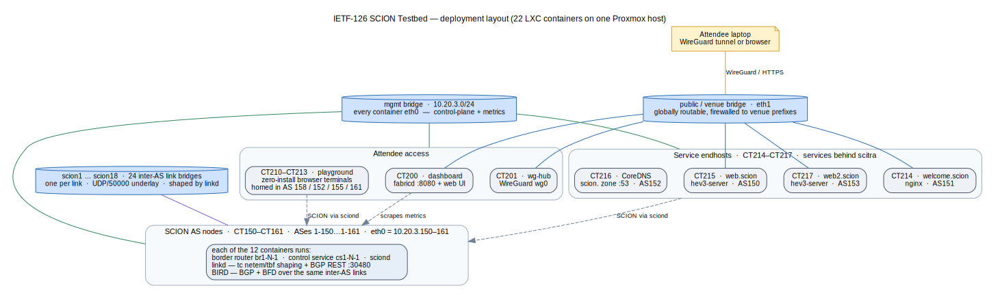

# IETF 126 Vienna Hackathon — SCION Testbed

A 12-AS SCION network that runs as
Proxmox LXC containers, built for the SCION Secure Path-Aware Routing
project at the IETF 126 hackathon. Attendees join it as real SCION
endhosts — over WireGuard from their laptop or through a zero-install
browser terminal — and compare path-aware SCION against ordinary BGP/IP
routing on identical links.

## What's in this repo

- **Dashboard** (`dashboard/` — `fabricd` backend + web UI): live topology
  and traffic map, per-link shaping controls (latency/bandwidth/jitter/loss),
  ID-INT path tracing, BGP session badges and a BGP path overlay, plus the
  attendee join flow (WireGuard conf claim, endhost bundles, testbed TLS CA).
- **linkd** (`linkd/`): per-AS link-shaping daemon (`tc` netem/tbf on the
  inter-AS interfaces) with a REST API; also reports BGP sessions/routes.
- **BGP/IP fabric** (`config/AS*/bird.conf`, `ansible/`): BIRD + BFD over
  the same inter-AS links — the "today's Internet" comparison plane, with
  per-AS anchor names (`as150.scion` … `as161.scion`).
- **SCION DNS** (`config/coredns/`, `tools/build-coredns.sh`): upstream
  CoreDNS patched for SCION, serving the `scion.` zone with SVCB
  `scion=`/`scion-policy=` SvcParams and `scion=` TXT records, plus the
  `scitra` plugin (SCION-IP-translator AAAA synthesis).
- **Attendee access** (`ansible/`, `proxmox/`): WireGuard hub + join page,
  browser playground containers, per-AS endhost bootstrap servers.
- **Topology tooling** (`topology/`): source-of-truth topo files, beacon
  staticinfo metadata sync, and consistency verification.

## Topology

ISD 1, ASes `1-150` … `1-161`: four meshed core ASes (150–153), the rest
non-core beneath them, 24 inter-AS links (including one peering link).
Each AS container runs a border router, control service, and sciond, with
one bridge per inter-AS link. A management network (`10.20.3.0/24`)
carries control/metrics; the BGP fabric uses `10.<AS>.0.0/16` +
`fd00:beef:<AS>::/48` over the same wires. See `topology/topology.topo`
and `config/AS*/topology.json`.

## Testbed layout

The whole thing runs as **22 LXC containers on a single Proxmox host**, wired
together by three kinds of Linux bridge: an isolated **management** network
(`10.20.3.0/24`) for control and metrics, a **public/venue** leg for the
attendee-facing services, and **24 per-link bridges** (`scion1…scion18`) that
each carry one inter-AS link's SCION underlay and BGP fabric.

<!-- Diagram source: topology/testbed-layout.dot (graphviz). Regenerate with:
     dot -Tsvg topology/testbed-layout.dot -o topology/testbed-layout.svg
     dot -Tpng -Gdpi=150 topology/testbed-layout.dot -o topology/testbed-layout.png -->

Bridge names differ slightly per host (the venue-leg bridge may be `vmbr0`
or `pubnet`, depending on the host's existing wiring); the roles above are
stable. See
`proxmox/create_contianers.sh` for the container/bridge wiring and
`config/AS*/topology.json` for per-link interface and underlay detail.

## Related repositories

- [lschulz/scion](https://github.com/lschulz/scion) — the deployed SCION
  stack (ID-INT + border-router RTT/traffic metrics).
- [netsys-lab/dns-scion-svcb](https://github.com/netsys-lab/dns-scion-svcb)
  (branch `scion`) — DNS library with the typed `scion`/`scion-policy` SVCB
  SvcParamKeys. The testbed's DNS server is upstream
  [CoreDNS](https://github.com/coredns/coredns) patched with the scitra
  plugin (from
  [netsys-lab/coredns-scitra](https://github.com/netsys-lab/coredns-scitra))
  and pinned to this library — see `tools/build-coredns.sh` +
  `tools/coredns-scion.patch`.
- [netsys-lab/scion-hev3](https://github.com/netsys-lab/scion-hev3) — Happy
  Eyeballs v3 for SCION (racer library, CLI, demo server).
- [netsys-lab/draft-scion-svcb](https://github.com/netsys-lab/draft-scion-svcb)
  — the `scion` SVCB SvcParamKey Internet-Draft.

## Operating it

- Build, deploy, and rebuild-from-scratch: [DEPLOY.md](DEPLOY.md)
- Fleet health: `bash tools/booth-check.sh`
- Topology consistency: `python3 topology/verify_topology.py`
- Tests: `cd linkd && make test` · `cd dashboard/backend && go test ./...`
  · `cd dashboard/web && npx vitest run`
